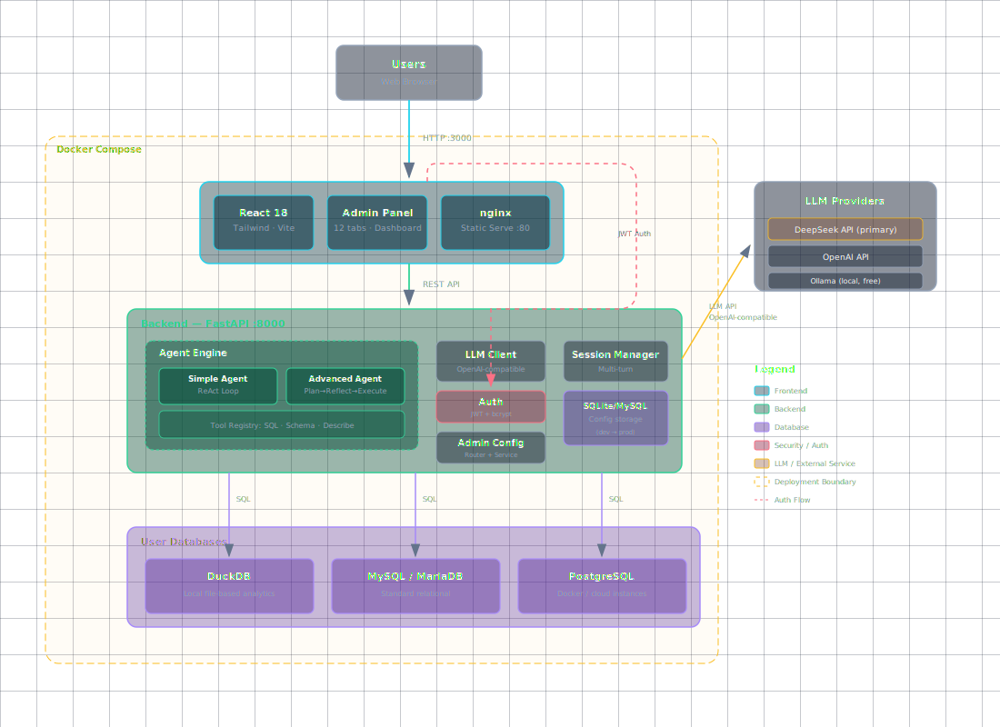

<p align="center">
  
  
  
  
  
  
</p>

# Shuyu (数语) — Open-Source Conversational Data Analyst

**Talk to any database in plain language. Built-in ReAct agent, no LangChain. LLM-agnostic. Multi-database.**

```bash
docker compose up -d
# Open http://localhost:3000 → configure LLM + database → start asking
```

---

## What is Shuyu?

Shuyu is an **open-source, ChatGPT-like data analyst** for non-technical users. Instead of writing SQL or building dashboards, you type questions in plain Chinese or English — the agent writes the SQL, queries your database, and returns the answer.

Built for **small businesses, startup teams, and anyone who has data but no BI team**.

### How it works

```
"上月赚了多少？"                                 "跟去年比呢？"
       ↓                                               ↓
  ┌─────────────────────────────────────────────────────────┐
  │  Agent writes SQL → queries your DB → returns answer    │
  │  Context preserved across turns → multi-turn analysis   │
  └─────────────────────────────────────────────────────────┘
```

No training. No dashboard building. No SQL required.

---

## Features

| Feature | Description |
|---------|-------------|
| 🗣️ **Natural language queries** | Ask in Chinese or English — the agent interprets intent, generates SQL, and returns answers |
| 🔄 **Multi-turn conversations** | Follow-up questions preserve context. *"What about last month?"* |
| 🧠 **Custom ReAct agent** | Self-built ReAct loop — no LangChain, no LangGraph. See every step |
| 🎯 **Dual-mode analysis** | Fast mode (ReAct) for precise questions, Deep mode (Plan→Reflect→Execute→Report) for complex analysis |
| 🔌 **Multi-database** | DuckDB ✅, MySQL ✅, PostgreSQL ✅ — Snowflake and more coming |
| 🔐 **Privacy-first** | Read-only mode, data approval gate, max row limits. Run fully offline with Ollama |
| 🎨 **Song dynasty UI** | Traditional Chinese aesthetic — ink, celadon, rice paper colors |
| 📁 **Database tree** | SSMS-like tree view in the sidebar — browse tables and columns |
| 💾 **Session persistence** | Conversations survive restarts (SQLite-backed) |
| 🐳 **One-command deploy** | `docker compose up -d` — backend, frontend, database all in one |

---

## Quick Start

```bash
docker compose up -d
```

Then open **http://localhost:3000**, register an account, configure your LLM (DeepSeek/OpenAI/Ollama) and database connection in the settings panel, and start asking questions.

---

## Database Support

| Database | Status |
|----------|--------|
| **DuckDB** (local `.duckdb`/`.db` files) | ✅ Working |
| **MySQL / MariaDB** | ✅ Working |
| **SQLite** | ✅ Working (config & persistence) |
| **PostgreSQL** | ✅ Working |
| **Snowflake** | 🚧 Planned |
| **BigQuery** | 🚧 Planned |
| **Redshift** | 🚧 Planned |
| **ClickHouse** | 🚧 Planned |
| **MSSQL Server** | 🚧 Planned |
| **Oracle** | 🚧 Planned |
| **Databricks** | 🚧 Planned |

Each database type is a thin connector (~100 lines of Python) implementing the `DatabaseConnector` interface.

---

## Tech Stack

| Layer | Technology |
|-------|-----------|
| Backend | Python 3.11 + FastAPI |
| Frontend | React 18 + Tailwind CSS + Vite |
| Agent | Custom ReAct loop (no LangChain) |
| Data Storage | DuckDB (analytics) + SQLite (config, sessions) |
| Auth | JWT + bcrypt |
| LLM Providers | OpenAI, DeepSeek, Ollama, any OpenAI-compatible API |
| Vector Store | ChromaDB |
| CI/CD | GitHub Actions (3 jobs: backend + frontend + docker) |
| Deployment | Docker Compose |

---

## Architecture

<p align="center">
  
</p>

The agent loop is provider-agnostic: swap between DeepSeek, OpenAI, or Ollama without changing any code.

> **Note:** The official DeepSeek API ([api.deepseek.com](https://api.deepseek.com)) has been thoroughly tested and is the recommended LLM provider. Other providers (OpenAI, Ollama, OpenAI-compatible APIs) are supported but have not been extensively tested.

---

## Project Structure

```
shuyu/
├── backend/                   # FastAPI backend
│   ├── app/
│   │   ├── main.py            # API routes + startup
│   │   ├── config.py          # Default config (no YAML needed)
│   │   ├── agent/
│   │   │   ├── simple_agent.py    # ReAct loop
│   │   │   ├── advanced_agent.py  # Plan→Reflect→Execute→Report
│   │   │   └── tools/             # SQL tool, tool registry
│   │   ├── db/                # Database connectors (DuckDB, MySQL, PostgreSQL, base)
│   │   ├── auth/              # JWT + bcrypt auth
│   │   ├── admin_config/      # Admin settings API
│   │   ├── routes/            # Chat, config, database, schema routes
│   │   └── models/            # Pydantic schemas
│   ├── Dockerfile
│   └── requirements.txt
├── frontend/                  # React + Tailwind CSS + Vite
│   ├── src/
│   │   ├── components/        # Sidebar, Chat, ConfigPanel, MessageBubble, etc.
│   │   ├── pages/             # Chat, Login, Register, Admin, Database manager
│   │   ├── store/             # Zustand state management
│   │   ├── hooks/             # useChatStream, useSessions, useDatabases
│   │   └── i18n/              # Multi-language support
│   ├── package.json
│   └── Dockerfile (nginx)
├── docker-compose.yml         # One-command deploy
└── docs/                      # Design specs (26+ design documents)
```

---

## Configuration

No YAML files needed. All settings are configured through the web UI and persisted in SQLite:

- **LLM** — provider, API key, model, base URL, connection test
- **Database** — connection info, table include/exclude filters
- **Safety** — read-only mode, data approval gate, max rows limit
- **Prompt management** — customize system prompts per agent mode

All settings survive restarts.

---

## Why no LangChain?

Shuyu's ReAct agent loop is built from scratch (~300 lines). This means:

- ✅ Full control over every step — no framework surprises
- ✅ Easy to debug — single-threaded, linear execution
- ✅ 492+ tests — comprehensive coverage
- ✅ Lightweight — no dependency bloat
- ✅ **Better for interviews** — you can explain every line

---

## Comparison

| | Shuyu | Databricks Genie | WrenAI |
|---|---|---|---|
| Open source | ✅ MIT | ❌ Proprietary | ✅ Apache 2.0 |
| Self-hosted | ✅ `docker compose up` | ❌ Cloud only | ✅ Docker |
| Agent | Custom ReAct | Unknown | LangChain-based |
| UI | Song dynasty aesthetic | Standard enterprise | Modern dashboard |
| Database connectors | DuckDB + MySQL + PostgreSQL | Delta Lake | PostgreSQL |
| Privacy | ✅ Read-only + approval gate | Enterprise controls | Data masking |

---

## License

MIT — free to use, modify, and deploy. See [LICENSE](./LICENSE).

---

# 数语 (Shuyu) — 开源数据库对话助手

> 像 ChatGPT 一样跟数据库对话。docker compose up 就能用。

## 谁适合用？

**小公司老板和非技术用户**——有数据但没有 BI 团队。

- 仓库库存数据在 DuckDB 里？→ Agent 帮你查
- 电商订单在 MySQL 里？→ 直接打字问销售额
- 想知道上月利润？→ 打字就行，不用写 SQL

不用培训，不用搭仪表盘，直接问。

## 快速开始

```bash
git clone https://github.com/raycdut/shuyu.git
cd shuyu
docker compose up -d
```

打开 http://localhost:3000 → 注册账号 → 配置 LLM（DeepSeek / OpenAI / Ollama）→ 连接数据库 → 开始提问。

## 适用场景

- **电商运营**：查询每日/每月销售额、订单趋势、客户分析
- **仓库管理**：库存盘点、出入库统计、商品周转率
- **财务分析**：收入支出对比、毛利计算、同比环比
- **制造业**：生产数据查询、质量统计、设备效率分析

## 支持的 LLM

| Provider | 配置方式 | 费用 |
|----------|---------|------|
| DeepSeek | API key | 极低 (~$0.02/次分析) |
| OpenAI | API key | 标准费率 |
| Ollama（本地） | 无需 key | 免费，零泄露 |
| 任何兼容 OpenAI 的 API | Base URL + Key | 自定 |

> **说明：** 官方 DeepSeek API（[api.deepseek.com](https://api.deepseek.com)）经过充分测试，是最推荐的 LLM 提供商。其他提供商（OpenAI、Ollama、兼容 OpenAI 的 API）虽支持但未做充分测试。

## 技术沉淀

- 自建 ReAct Agent Loop，不依赖 LangChain/LangGraph
- 双模式分析：快速模式（ReAct）+ 深度模式（Plan→Reflect→Execute→Report→Reflect）
- 多数据库连接器抽象：DuckDB ✅ / MySQL ✅ / PostgreSQL ✅
- 前后端分离：React + Tailwind + FastAPI
- 宋氏美学 UI：水墨色、青瓷绿、宣纸白配色，楷体/宋体字体栈
- 完整用户体系：注册 / 登录 / JWT 鉴权 / 管理员设置
- 管理员运营看板：Token 用量、活跃用户、模型分布
- Prompt 管理：6 分类版本化管理，支持编辑/恢复默认
- 数据库 Schema 管理：导入结构、AI 生成字段描述、中英文双语编辑
- 数据可视化：柱状图/折线图/饼图智能检测，可手动切换
- MySQL、PostgreSQL 密码加密存储
- 26+ 篇架构设计文档
- 492 个测试用例，CI 全自动验证

## 贡献

欢迎提交 Issue 和 PR。当前优先需要的贡献：

- 更多数据库类型支持（Snowflake、BigQuery、ClickHouse 等）
- Docker Compose 自动配置指南

## 联系

- GitHub: [raycdut/shuyu](https://github.com/raycdut/shuyu)

---

<p align="center">
  <sub>Made with ❤️ and a lot of tea. 宋氏美学 · 自建 Agent · 开源 MIT</sub>
</p>
